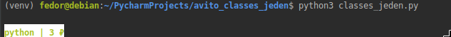

```
~/PycharmProjects/avito_classes_jeden$ python3 -m pytest
==================================================================================== test session starts ====================================================================================
platform linux -- Python 3.7.3, pytest-5.4.1, py-1.8.1, pluggy-0.13.1
rootdir: /home/fedor/PycharmProjects/avito_classes_jeden
collected 9 items                                                                                                                                                                           

test_classes_jeden.py .ss......                                                                                                                                                       [100%]
```

